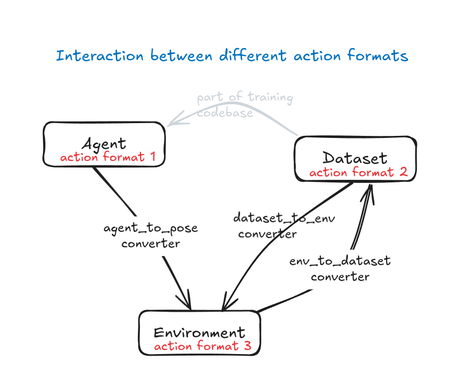

# robot-imitation-glue

Framework to reduce engineering efforts in using imitation learning for robot manipulation.

Facilitates:
- Dataset Collection (Lerobot dataset format) through **teleoperation** (Gello and Spacemouse supported but you can easily add others)
- Modifying/filtering **Lerobot Datasets**
- Replaying datasets on real hardware (for debugging)
- **Evaluating trained policies** on real hardware and save rollout observations(supports Lerobot ACT/ DP, OpenVLA, Pi0 and Pi-Fast but you can easily add others)

Everything is visualized using Rerun.

The code is written modularly so that you can easily:

1) integrate a new hardware setup
2) evaluate new learning algorithms
3) integrate new teleoperation methods

## Some core design decisions and assumptions

- code to describe and train networks for policy is not part of this codebase, recommended flow is to collect dataset here, train in separate codebase and then evalute the trained policy using a webserver (to avoid dependency issues and maintain separation of concerns).

- policies and teleop devices are both abstracted as agents.

- we assume a single robot arm + gripper. Control interface is absolute end-effector poses + absolute gripper width.

- we use the Lerobot dataset format and tooling to store demonstrations and rollouts.

- Callbacks are provided to switch between different action formats for the dataset/ policies:

## Examples

2 examples are available of how to integrate this codebase for your robot.
Both are powered using our airo-mono repo, but you can freely select a control stack for your hardware.

### UR5station

### UR3station

## Development

### installation

- clone this repo
- initialize and update submodules: `git submodule update --init`
- create the conda environment `conda env create -f environment.yaml`

## Dataset visualisation:

python lerobot/lerobot/scripts/visualize_dataset_html.py   --root datasets/2025-04-29_15-40-01/ --force-override 1 --repo-id test/test

In the above, the --repo-id doesn't matter, so literally test/test is fine.

## Preprocessing

robot_imitation_glue > ur5station > prepare_datasets.py

Redo visualisation above

## Dataset merging

python lerobot/lerobot/scripts/merge.py --sources datasets_tmp/clothes-hanger-v3p5-EVAL-successes-visionOnly/ datasets_tmp/clothes-hanger-v3p5-rollouts4augmentation-visionOnly/ datasets_tmp/clothes-hanger-v3p6-w500h720-2cam-visionOnly/ --output datasets_tmp/clothes-hanger-v8-visionAugmentedByInstrRollouts --max_dim 7 --fps 10

## Training

python lerobot/lerobot/scripts/train.py --config_path=robot_imitation_glue/ur5station/lerobot_train/...config.json

python ./robot-imitation-glue/lerobot/lerobot/scripts/train.py --config_path=robot-imitation-glue/robot_imitation_glue/uR3station/lerobot_train/pick-block-diffusion-config.json

(extra info in lerobot > examples > advanced > 4_train_policy_with_script)

model size parameters in config: "down_dims", "kernel_size", "diffusion_step_embed_dim",

screen -S session_name -> starts session
ctrl+a ctrl+d -> detaches session
screen -Rd session_name -> reattaches session

## Evaluation

robot_imitation_glue > ur5station > eval_diffusion_lerobot.py

hf upload ramen-noodels/test_5_episodes ./datasets/test_5_episodes --repo-type=dataset
